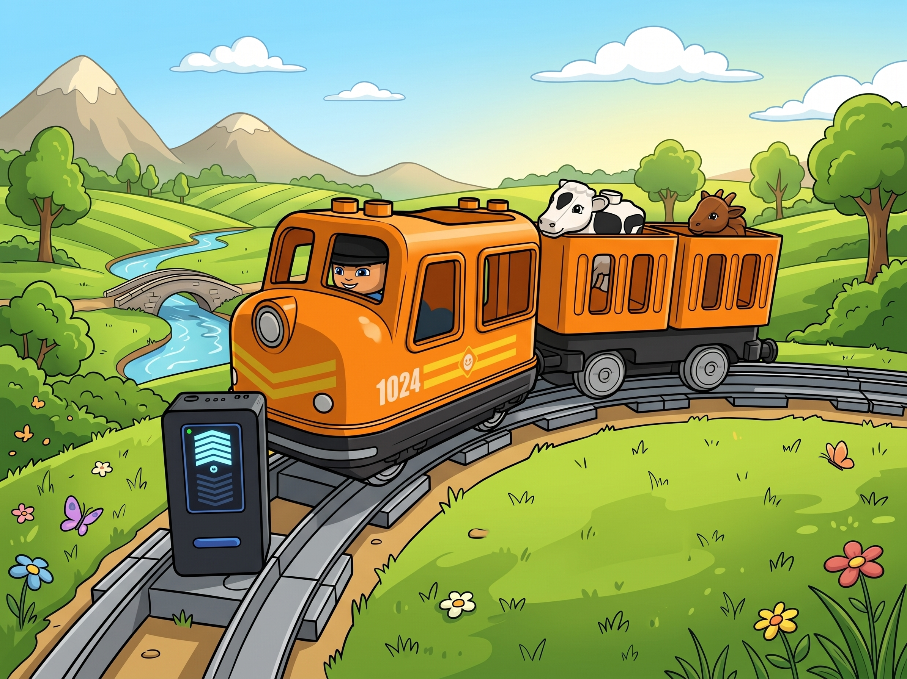
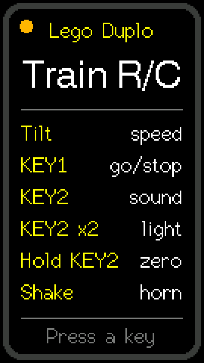
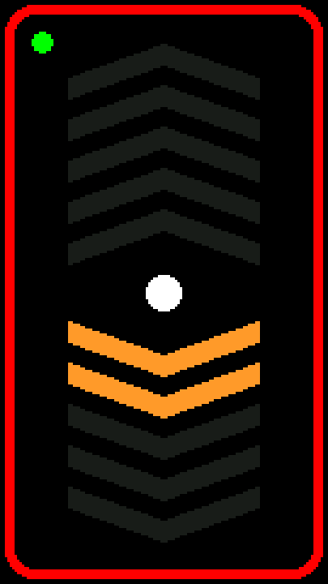
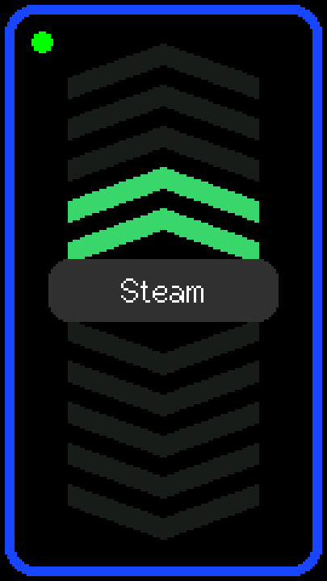

# Lego Duplo Train R/C



Firmware that turns an [M5StickS3](https://docs.m5stack.com/) into a
Bluetooth remote control for the LEGO® DUPLO® connected train, instead of the
smartphone app. Tilt the stick to drive, press a key to start and stop, shake
it to sound the horn. The screen is made for small children: no text while
driving, just big chevrons that light up with the speed.

**Tested with the LEGO DUPLO Cargo Train, set 10875.** Other DUPLO trains
built on the same Bluetooth train base (for example the Steam Train, 10874)
speak the same protocol and will probably work too, but they have not been
tried.

## Features

- Finds the train by itself and connects to it; reconnects when the train is
  switched off and on again.
- Speed and direction from the tilt of the stick: five levels forward, five
  backward.
- Start and stop on one key; every stop plays the train's brake sound.
- The train's built-in sounds (steam, departure, water refill) on the other
  key, the horn on a shake.
- The colour of the train's light: off, red, blue, green, white.
- A splash screen with a short how-to at power-on.
- The display turns itself off after 3 minutes without activity (but never
  while the train is running).

## Screens

<table>
  <tr>
    <td align="center"></td>
    <td align="center"></td>
    <td align="center"></td>
  </tr>
  <tr>
    <td align="center">Splash screen at power-on</td>
    <td align="center">Searching for the train</td>
    <td align="center">Connected, standing: the outline shows the tilt</td>
  </tr>
  <tr>
    <td align="center"></td>
    <td align="center"></td>
    <td align="center"></td>
  </tr>
  <tr>
    <td align="center">Running forward, level 4, green light</td>
    <td align="center">Running backward, level 2, red light</td>
    <td align="center">Playing a sound, blue light</td>
  </tr>
</table>

How to read the screen:

- **Chevrons**: five up for forward, five down for backward. As many light up
  as the speed level the tilt gives.
- **Outlined** chevrons and a **ring** in the middle: the train stands, and
  the chevrons show what KEY1 would start it with. **Filled** chevrons (green
  forward, orange backward) and a **filled dot**: the train runs.
- **Frame**: the colour of the train's light; grey while the light is off.
- **Dot in the corner**: blinking orange while searching for the train,
  yellow while connecting, green when connected. Until it connects, the
  middle of the screen says *Searching...* or *Connecting...*.
- **A word in the middle** for a moment: the sound or the light colour just
  sent to the train.

## Controls

Hold the stick upright in portrait, screen towards you, the way you would
look at it.

| Input | Action |
|---|---|
| Tilt the top away from you | Forward, faster the further you tilt (5 levels) |
| Tilt the top towards you | Backward, the same way |
| **KEY1** (the blue button on the front) | Start the train at the tilted speed, or stop it (with the brake sound) |
| **KEY2** (the button on the side), once | Next sound: steam, departure, water refill |
| **KEY2** twice | Next light colour: off, red, blue, green, white |
| **KEY2** held for 1.5 s | Make the current grip the "zero" (see below) |
| Shake the stick | Horn |
| Power button | Single press: power on / restart; double press: power off |

Details:

- While the train runs, it follows the tilt all the time, through zero into
  reverse. While it stands, tilting only changes the preview on the screen.
- When the display is off, the first press of a key only wakes it up. The
  press that closes the splash screen does nothing else either.
- On every connection the train's light is switched off, so the screen and
  the train start out the same.

### Zero tilt

The speed is counted from a "zero" angle: the angle at which you naturally
hold the stick. Within 6° of it the train stands; every further 6° adds a
level, up to level 5 at about 36°.

The default zero is 55° from upright (the screen leaning back towards you),
measured from an adult's grip. If the train creeps forward or backward while
you hold the stick still, set your own zero: hold the stick the way you like
and keep **KEY2** pressed for 1.5 s, until *Zero set* appears. The zero is
saved in the stick's memory and survives power-off.

Lying flat on a table, screen up, is far from zero, so the screen shows full
forward. That is only a preview: the train does not move until KEY1 is
pressed.

## Getting started

### What you need

- An M5StickS3.
- A LEGO DUPLO connected train (tested: Cargo Train 10875) with charged
  batteries.
- To build from source: a Mac or PC with [PlatformIO](https://platformio.org/)
  (the VS Code extension or the command line) and a USB-C cable.

### Build and flash

```bash
git clone https://github.com/mbogatyr/M5LegoDuploTrain.git
cd M5LegoDuploTrain
pio run -e sticks3 -t upload
```

If the PlatformIO command line came with the official installer, it is not on
`PATH`; call it as `~/.platformio/penv/bin/pio`.

The first build downloads the ESP32-S3 toolchain (several minutes, once per
machine), [M5Unified](https://github.com/m5stack/M5Unified) and
[NimBLE-Arduino](https://github.com/h2zero/NimBLE-Arduino).

If flashing fails with *Failed to connect to ESP32-S3: No serial data
received*, hold the power button until the green LED inside the stick blinks
(download mode) and flash again.

### Single image for M5Burner

```bash
pio run -e sticks3 -t merged
```

This writes `.pio/build/sticks3/firmware-merged.bin`: the bootloader, the
partition table and the application in one file, to be written at address
0x0, which is what [M5Burner](https://docs.m5stack.com/en/download) does.

### First run

1. Switch the stick on. The splash screen shows the controls; press a key or
   wait 15 seconds.
2. Switch the train on. Its light blinks while it waits for a connection.
3. The dot in the corner turns green and the train's light goes off: the
   train is connected and standing.
4. Hold the stick comfortably, press KEY1 and tilt.

## Troubleshooting

| Problem | What to do |
|---|---|
| The stick keeps *Searching...* | The train only waits for a connection for a short while after it is switched on: switch it off and on again. Make sure no phone or tablet is connected to it. |
| The train moves while you hold the stick still | Set your own zero: hold KEY2 for 1.5 s in your usual grip. |
| The train rolls when the screen says it stands | It was told to brake and is told again a few times during the next 3 s. If it still happens, please open an issue; the `ble` log below shows what was sent. |
| The screen went dark | The display turns off after 3 minutes without activity; press any key. |
| No battery level for the train | The train does not report it: it answers neither the battery request nor a subscription to its voltage sensor. |
| Flashing fails | Hold the power button until the green LED blinks, then flash again. |
| The stick does not start after the serial port was opened by a script, and the port shows *waiting for download* | Press the power button once. `tools/serial_cmd.py` opens the port in a way that avoids this. |

## How it works

The DUPLO train's locomotive is a Bluetooth Low Energy hub speaking the
[LEGO Wireless Protocol 3.0](https://lego.github.io/lego-ble-wireless-protocol-docs/),
like the other Powered Up hubs.

- **Finding the train.** The stick scans for advertisements whose
  manufacturer data starts with LEGO's company id (`97 03`) and has system
  type `0x20`, the DUPLO Train Base, and connects to the first one.
- **One characteristic.** All commands are written to characteristic
  `00001624-1212-efde-1623-785feabcd123` of service
  `00001623-1212-efde-1623-785feabcd123`; the train answers through
  notifications on the same characteristic.
- **Ports.** Right after connecting the train lists its ports: motor `0x00`,
  speaker `0x01`, light `0x11`, colour sensor `0x12`, speedometer `0x13`,
  voltage `0x14`. The remote uses the first three.
- **Commands.** Everything is a *port output command, write direct mode
  data*: `08 00 81 <port> 11 51 <mode> <value>`.
  - Motor: mode 0, power -100..100 %, or 127 to brake.
  - Speaker: mode 1, sound 3 brake, 5 departure, 7 water refill, 9 horn,
    10 steam.
  - Light: mode 0, colour 0 (off) to 10 (white) from the LEGO palette.

What was learned on the train:

- **Stopping needs the brake.** Power 0 only lets the motor go: sometimes the
  train played the brake sound and rolled on. Stops are now sent as the brake
  (127) and repeated 0.2, 0.6, 1.5 and 3 s later.
- **No bursts right after connecting.** Setup commands sent back to back were
  not all handled and the first light colour was lost; they now go out 100 ms
  apart, and the light colour is repeated like the brake.
- **No battery level**: see Troubleshooting.
- The train does not move below about 25 % power, so the five levels are
  30, 45, 60, 80 and 100 %.

### Code layout

```
lib/        Plain C++ logic, no hardware: tested on the computer
  DuploProtocol/   the train's messages, byte by byte
  TrainControls/   running or standing, speed level, sound and light cycles
  TiltThrottle/    accelerometer -> speed level, with zero, dead zone, hysteresis
  ShakeDetector/   a jolt above 2.2 g, at most once per 1.2 s
  Repeats/         when to send a command again (brake, light)
  DisplayTimeout/  display off after 3 minutes without activity
src/        Everything that knows about the board
  TrainLink        the Bluetooth connection (NimBLE-Arduino)
  Renderer         the screen, drawn in a sprite and pushed in one go
  main.cpp         buttons, accelerometer, link and screen wired together
test/       Unity tests for every module in lib/
tools/      serial_cmd.py (screenshots and logs over USB), merged_image.py
docs/images/  the banner and the screenshots in this README
```

## Development

```bash
pio test -e native        # unit tests on the computer, no board needed
pio run -e sticks3        # build
pio run -e sticks3 -t upload
```

`tools/serial_cmd.py` talks to the running firmware over USB without
resetting it (it needs only pyserial, which comes with PlatformIO):

```bash
PY=~/.platformio/penv/bin/python
$PY tools/serial_cmd.py snap screen.png           # screenshot of the display, 3x
$PY tools/serial_cmd.py send ble --wait 60        # every message to (->) and from (<-) the train
$PY tools/serial_cmd.py send acc --wait 5         # accelerometer, tilt angle, zero and level
$PY tools/serial_cmd.py send "demo k 4 1 6"       # show a made-up screen (here: running, level 4, green)
$PY tools/serial_cmd.py send live                 # back to the real screen
```

`ble` and `acc` are toggles: send them again to turn them off. The
screenshots in this README were taken with `demo` and `snap`; `demo` takes
`splash`, or `<s|c|k> <level> <running 0|1> <colour 0-10> [word]` for
searching, connecting or connected.

## Acknowledgements

The protocol details come from the official LEGO Wireless Protocol 3.0
documentation and from projects that drive the DUPLO train already:
[Legoino](https://github.com/corneliusmunz/legoino),
[node-poweredup](https://github.com/nathankellenicki/node-poweredup) and
[Pybricks](https://pybricks.com/project/control-the-duplo-train/).

LEGO and DUPLO are trademarks of the LEGO Group, which does not sponsor,
authorize or endorse this project.
